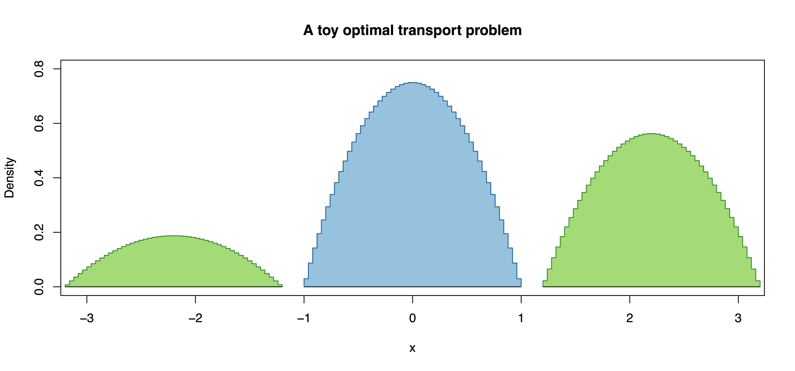

##Modelling the evolution of bird song##

Here is a circle of tools developed to transfer ideas from molecular evolution to the modelling of father-to-son transmission of birdsong in, at least initially, [Java sparrows](https://en.wikipedia.org/wiki/Java_sparrow). We work with songs described as sequences of notes, a description that, at least for us, depends on human observers studying spectrograms. One could try to adapt [TweetyNet](https://github.com/yardencsGitHub/tweetynet) or similar tools.  Given a collection of songs described as note sequences, we aim to work through the following broad outline:

* Use [profile Hidden Markov Models](https://academic.oup.com/bioinformatics/article/14/9/755/259550?login=false) to align segments of the sings and so to discover *motifs*: segments of song that are, at least approximately, repeated in an individual bird's sings or in the songs of many birds.
* Use [distance measures derived from optimal transport](https://doi.org/10.48550/arXiv.1306.0895) to define distances between notes.
* Use these distances to construct a generation-to-generation transmission matrix---similar to scoring matrices used in tree construction---to model song transmission.

###Lightning introduction to optimal transport###
Suppose we have a pile of sand represented as a probability density function (PDF) $f_1(x)$ and we want to shift the sand to a differently-shaped pile, represented by the PDF $f_2(x)$ and suppose further that it costs an amount of effort $C(x_1, x_2)$ to shift a unit of sand from $x_1$ to $x_2$. Then the associated *Kantorovich optimal transport problem* is to find a probability distribution with density $T(x_1, x_2)$, where $x_1$ ranges over the support of $f_1$ and $x_2$ over the support of $f_2$, such that $T(x_1, x_2)$ is the amount of probability mass that we move from $x_1$ to $x_2$.  Conservation of stuff then requires

$\int T(x, x_2) \, dx_2 = f_1(x) \qquad$ and $\qquad \int T(x_1, x) \, dx_1 = f_2(x)$.

and we want to choose $T(x_1, x_2)$ in such a way as to minimise the cost of the transfer, which is given by

$\int \int C(x_1, x_2) T(x_1, x_2) \, dx_1 dx_2$.

There are (hard) associated PDEs, but the associated discretised, numerical problem is considerably easier. If we divide the supports of the $f_j$ into bins and construct the associated histograms so that, say, the discretised version of the source distribution $f_1$ becomes $p_1, \dots, p_n$, while the discretised version of the target $f_2$ is $q_1, \dots, q_m$. We then seek to minimise 

$\sum_{i,j} C_{i,j} T_{i,j} \;$ subject to the constraints $\; q_i = \sum_{j=1}^n T_{i,j} \;$ and $\; p_j = \sum_{i=1}^m T_{i,j}$, 

where the entry in the cost matrix $C_{i,j}$ gives the cost of moving a unit of probability mass (that is, sand) from bin $j$ in the support of $f_1$ to bin $i$ in the support of $f_2$.

As all the expressions above---both the cost and all the constraints---are linear in the $T_{i,j}$, our discretised optimal transport problem is an example of a [*linear programming problem*](https://en.wikipedia.org/wiki/Linear_programming) and so could, in principle, be solved with standard libraries.  But these can be as slow as $O(n^3 \log(n))$ when computing transport plans between two histograms of size $n$. To address this issue, Marco Cuturi suggested, in 

> Marco Cuturi (2013), [Sinkhorn Distances: Lightspeed Computation of Optimal Transportation Distances](https://papers.nips.cc/paper/2013/hash/af21d0c97db2e27e13572cbf59eb343d-Abstract.html), Advances in Neural Information Processing Systems **26**:2292--2300.

that one instead solve an associated regularised problem in which one seeks to minimise

$\sum_{i,j} C_{i,j} T_{i,j}  - \varepsilon H(T) \;$ where $\; H(T) = -\sum_{i,j} T_{i,j} \log \left( T_{i,j} \right)$ is the [entropy](https://en.wikipedia.org/wiki/Entropy_(information_theory)) of the joint distribution $T_{i,j}$. This turns out to be faster and more numerically stable and, in the limit of small $\varepsilon$, to yield the solution to the original problem.

####Code to compute Sinkhorn distances####

Files supporting this part of the task include:

`ParabolicPdf.R`
: Provides a probability density function (PDF) and cumulative density function (CDF) for a distribution supported on $(-1, 1)$ with PDF $f(x)$ given by $f(x) = \frac{3}{4}(1 - x^2).$ We use this to make test data for the Sinkhorn distance routines described below.

`ShortTest.R`
: Constructs two discretised distributions and finds entropy-regularised optimal transport plans between them for a range of values of $\epsilon$. Here the source distribution is a single  parabolic bump (the blue one in the image below) and the other of a pair of parabolic bumps (green, below) constituting a mixture distribution.

	We then use the Sinkhorn algorithm to compute entropy-regularised distances between the two distributions illustrated above with $\epsilon \in \{2^{-j}\}_{j=1}^7$: the results should be something like

	|   Epsilon| Distance|  Entropy|Converged | N.Cycles| Elapsed.Millisecs|
	|---------:|--------:|--------:|:---------|--------:|-----------------:|
	| 0.5000000| 1.967728| 6.603764|TRUE      |       20|          0.923894|
	| 0.2500000| 1.948855| 6.398241|TRUE      |       40|          1.776940|
	| 0.1250000| 1.935566| 6.149656|TRUE      |       70|          3.166512|
	| 0.0625000| 1.929044| 5.867661|TRUE      |      140|          6.503666|
	| 0.0312500| 1.924934| 5.567104|TRUE      |      270|         12.089342|
	| 0.0156250| 1.923170| 5.250683|TRUE      |      540|         51.648274|
	| 0.0078125| 1.922201| 4.922237|TRUE      |     1080|         49.979369|

`SinkhornDistances.R`
: Defines a function 

	`entropyRegularisedKOT(p, q, cost.mat, epsilon=1.0, 
	tol=1.0e-6, max.cycles=200, cycles.per.check=10,
	print.progress=FALSE)` 

	where
	
	* `p` is a vector holding the source histogram;
	* `q` is a vector holding the target histogram;
	* `cost.mat` is a `length(q)`-by-`length(p)`  matrix whose `[i,j]` entry is the cost of moving a unit of probability mass from bin `j` in `p` to bin `i` in `q`;
	* `epsilon` multiplies the entropy-regularisation term;
	* `tol` is used in a convergence test: we stop iterating when $|q_i - _\sum_{j} T_{i, j}| < $ `tol`.
	* `max.cycles`, an upper limit on the number of Sinkhorn iterations, prevents infinite loops;
	* `cycles.per.check` is the number of iterations between (expensive) convergence tests;
	* if `print.progress` is `TRUE` the code prints some information after every convergence test.
	
	This function checks its arguments, then invokes a C++ engine that does that does the bulk of the work.

`SinkhornDistanceEngine.cpp`
: A C++ implementation of the log-domain Sinkorn iterations described in Section 4.4, *Stability and Log-Domain Computations* of
> Gabriel Peyré and Marco Cuturi (2019), [Computational Optimal Transport](https://doi.org/10.48550/arXiv.1803.00567), *Foundations and Trends in Machine Learning*, **11**(4-5):355--607.